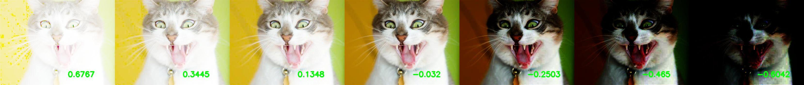

# Overview
Implement the paper "[Towards Automatic Image Exposure Level Assessment](https://www.hindawi.com/journals/mpe/2020/2789854/#data-availability)".  
Dataset can also be found in the link above.

# Demo
The higher the image exposure level is, the bigger the prediction should be.  
(Prediction will be in the range [-1, 1])



# Train
```
python train.py -tr synthetic -test real/ -tr_txt synthetic-scores.txt -test_txt real-scores.txt -size 224 -bs 64 -lr 0.001 -wd 0.0001 -seed 10 -epoch 10
```

# Test
```
python test.py -img img/cat_1.jpg -model {model path} -device cpu
```
